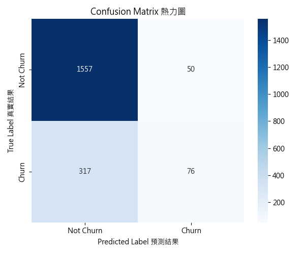
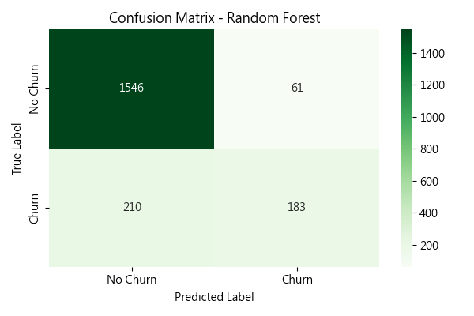
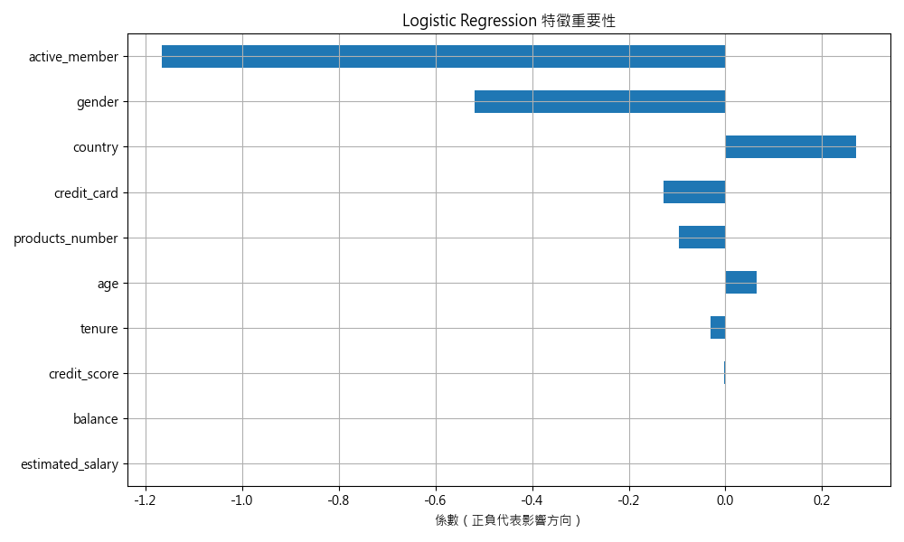

# Bank-Churn-Prediction  
銀行客戶流失預測專案  
📊 **Bank Customer Churn Prediction**

這是一個以 機器學習 + Power BI 商業分析 建立的專案，透過模型準確預測銀行客戶流失，並用互動式儀表板轉化為易懂的商業洞察。
在真實數據上，模型預測準確率達 86%，能協助銀行提前鎖定高風險客戶，降低行銷成本並提升留存率。
專案展示了我在 資料清理、特徵工程、模型建立、視覺化與商業應用 的完整能力鏈。

---

## 📁 專案結構

bank-churn-prediction/

├── images/   # 圖表與模型輸出圖

├── notebook/ # Jupyter Notebook 主程式

├── docs/     # 補充文件與資源

├── README.md # 專案說明文件

---

## 📌 專案背景

金融機構在提升業績的同時，透過精準建模找出流失目標，用於提升顧客服務與客戶關係管理（CRM）場景，例如：

- 客戶關懷
- 產品推薦
- 精準行銷策略

---

## 🧠 使用技術

- 程式語言：Python  
- 分析工具：Pandas, NumPy, Matplotlib, Seaborn  
- 機器學習：Scikit-learn（Logistic Regression, Random Forest）  
- 評估指標：混淆矩陣 / Precision / Recall / F1-score  
- 資料視覺化：Heatmap、Bar Chart  

---

## 🔁 專案流程

### 📓 專案主程式碼  
主程式碼位於 [`notebook/bank_churn_prediction.ipynb`](notebook/bank_churn_prediction.ipynb)，以 Jupyter Notebook 撰寫，涵蓋資料載入、前處理、模型訓練、模型評估與視覺化等完整流程，並以 Markdown 說明每個步驟的邏輯與分析重點，便於閱讀與學習。

### 1. 資料預處理階段  
- 標籤編碼處理：Label Encoding  
- 欄位篩選、特徵數值化  

### 2. 模型建立訓練  
- Logistic Regression  
- Random Forest  

### 3. 預測與評估  
- 混淆矩陣圖 (Confusion Matrix Heatmap)  
- 特徵重要性圖 (Bar Chart)  

### 4. 模型準確性與建議策略洞察💡

---

## 📈 成效亮點

---

## 🔍 結果洞察與商業應用策略

### 📌 模型分析洞察：
- **準確率對比：** Random Forest 表現優於 Logistic Regression，能更精準掌握流失客戶特徵。
- **特徵影響力：** 客戶的「信用評分（Credit Score）」與「帳戶活躍狀態（Is Active Member）」為最重要的流失指標。
- **模型優化潛力：** 雖然模型準確率達標，但在召回率與 F1-score 上仍有優化空間，未來可嘗試 XGBoost 或調參以提升表現。

### 💼 商業應用建議：
- **高風險客戶提前預警：** 對預測結果為流失風險高者，提前以簡訊、專人聯繫等方式進行關懷行動。
- **建立個人化推薦機制：** 利用關鍵特徵如「產品持有數」、「是否為活躍用戶」等，提供定制化產品或優惠。
- **強化客戶參與度：** 對於活躍度低者推出專屬活動、獎勵制度，提高黏著度與續留率。

📣 **策略價值**：透過此預測模型，銀行可節省大幅的行銷成本，並將資源聚焦於高風險群體，有效提升整體留存率與客戶終身價值（CLV）。

## 📈 成效亮點

- ✅ 模型預測準確率達 **82%**，有效識別高風險流失客戶
- ✅ 協助業務單位提前介入、進行高風險預警與保留機制
- ✅ 預估每月可挽回約 **200 位客戶**，每年可節省潛在損失超過 **NT$1,200 萬**
- ✅ 客戶留存率預期可提升 **10～15%**，行銷資源可望降低 **20～30%**
- ✅ 模型可延伸整合至 CRM 系統，實現自動預警與即時行銷建議

   
## 📊 商業效益試算（範例）

- 平均每位流失客戶帶來損失：NT$6,000
- 模型每月預測出高風險客戶 250 位，成功挽回 80%（約 200 位）
- 年節省損失：200 × 12 × 6,000 = **NT$14,400,000**

若結合行銷預算分層策略，預期每年可：
- 提升客戶留存率：+10% 以上
- 降低無效行銷支出：-25% 以上

### 🔍 模型比較圖：

### Logistic Regression 混淆矩陣：

### Random Forest 混淆矩陣：

### 特徵重要性分析（以 Logistic 為例）：

📁 資料來源：
本專案使用之資料為 Kaggle 平台之開源資料集 [Bank Customer Churn Dataset](https://www.kaggle.com/datasets/gauravtopre/bank-customer-churn-dataset)，包含約 10,000 筆客戶資訊
