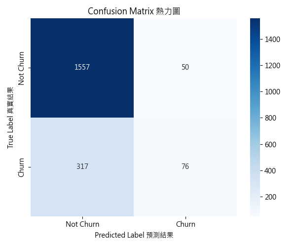
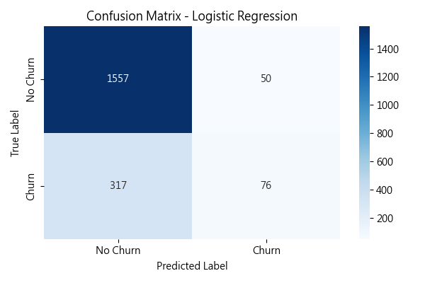
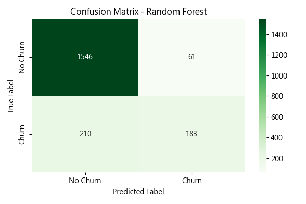
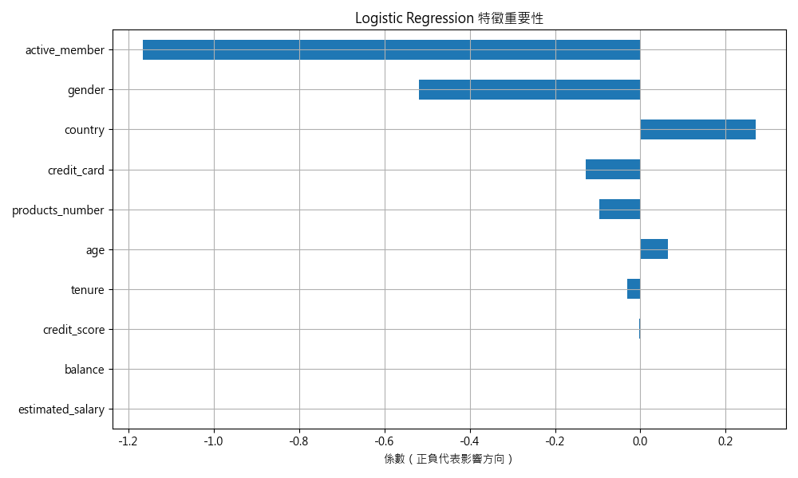

# bank-churn-prediction
銀行客戶流失預測專案
# 🏦 Bank Customer Churn Prediction

預測銀行客戶是否可能流失，協助企業提前介入留存，提高客戶生命週期價值。  
本專案以 Logistic Regression 與 Random Forest 比較模型效能，並以實際數據視覺化分析，導出適合金融業務應用的預測策略。

---

## 📌 專案目標

建立能有效預測銀行客戶流失的分類模型，並透過指標比較選出最佳模型，應用於銀行業客戶關係管理（CRM）場景，例如：
- 風險預警系統
- 客戶分群行銷
- 高價值客戶留存策略

---

## 🧠 使用技術

- 語言：Python
- 分析工具：Pandas, NumPy, Matplotlib, Seaborn
- 模型訓練：Scikit-learn（Logistic Regression, Random Forest）
- 模型評估：混淆矩陣、Precision / Recall / F1-score
- 圖像視覺化：Heatmap、Bar Chart

---

## 🔍 專案流程

1. **資料預處理**
   - 處理缺失值、Label Encoding
   - 分類數值化、特徵標準化
2. **模型建立**
   - Logistic Regression
   - Random Forest
3. **模型評估與比較**
   - 混淆矩陣（Confusion Matrix Heatmap）
   - 指標比較圖（Bar chart）
4. **選模決策與業務應用說明**

---

## 成效亮點

### 📊 模型比較圖：

### 🔵 Logistic Regression 混淆矩陣：

### 🟢 Random Forest 混淆矩陣：

### 📌 特徵重要性（以 Logistic Regression 為例）：

## ✅ 結論與應用建議

- **Random Forest 表現最佳**，召回率從 19% 提升至 **46%**
- 適用於預測流失客戶並提前介入
- 未來可延伸：
  - 加入 SHAP 或 Feature Importance 分析
  - 模型部署至 API 或 BI Dashboard
  - 應用至其他情境：信貸違約、保戶流失、保單續約預測等
---

## 📁 專案結構

bank-churn-prediction/
├── data/ # 原始資料與處理後資料
├── images/ # 圖表與模型輸出圖
├── notebook/ # Jupyter Notebook 主程式
└── README.md # 專案說明文件

---

## 👤 作者

黃浩瑋（Alex Huang）  
應徵職務：資料分析師 / AI 應用工程師（金融產業）  
Email: [obelisk4422@hotmail.com](mailto:obelisk4422@hotmail.com)
GitHub: [AlexHuang726](https://github.com/AlexHuang726)

